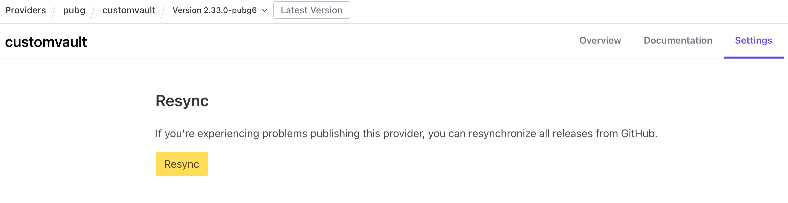

# Terraform-Provider-CustomVault

Includes the following
1. Support TencentCloud Vault Secret Engine
2. Check Current Access Token

# How to Develop

1. Clone Repository

```bash
git clone https://github.com/pubg/terraform-provider-customvault
```

2. Run as Debug Mode
```bash
# https://www.terraform.io/plugin/sdkv2/debugging#starting-a-provider-in-debug-mode
go run main.go --debug
```

3. Test Provider
```bash
export VAULT_TOKEN="my-token"
export VAULT_ADDR="my-vault-addr"

go test ./...
```

# Publish to Terraform Registry

1. Tag specific git commit(like "v3.0.0") and push.
2. Github Actions pipeline will run and upload artifacts to Github Releases.
3. Wait until Terraform Registry receive new release event.

If not published a long time, Click `Resync` Button in Registry settings menu.


